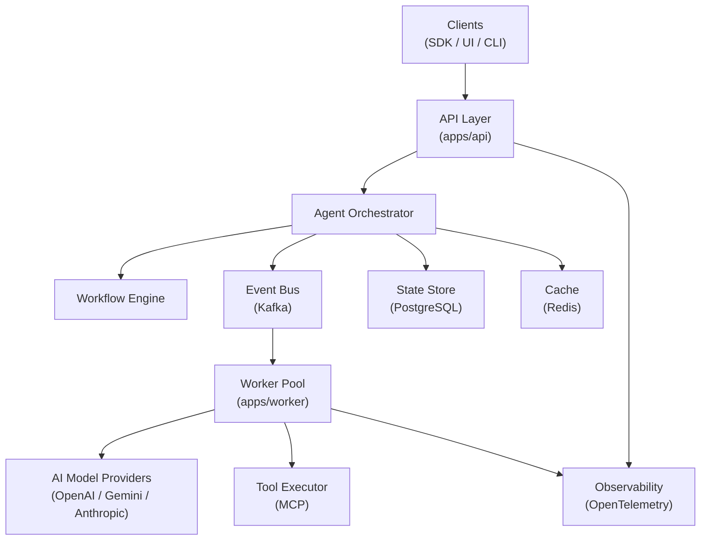

# Aegis

**Distributed AI Agent Execution Platform**

> Phase 0 — Repository & Engineering Foundation

---

## What is Aegis?

Aegis is an infrastructure platform for running **long-lived, multi-step AI agent workflows** reliably across distributed workers.

Think of it as the execution layer between your AI models and the real world: a platform that handles the hard parts — durable state, failure recovery, distributed execution, tool access, and observability — so that AI agents can focus on reasoning.

---

## Why does it exist?

Modern AI agents that perform real tasks (autonomous coding, research, complex analysis) face fundamental infrastructure problems that existing systems don't solve:

| Problem              | Today                                        | With Aegis                                      |
| -------------------- | -------------------------------------------- | ----------------------------------------------- |
| **Long execution**   | HTTP request/response cuts out after seconds | Durable workflows that run for minutes or hours |
| **Failure recovery** | Agent crashes = lost work                    | Checkpointed state, automatic retry             |
| **Tool access**      | Ad-hoc, unaudited                            | Controlled MCP tool execution with audit log    |
| **Concurrency**      | Single-node bottleneck                       | Distributed worker pool                         |
| **Observability**    | Black box                                    | Full trace of every agent decision and action   |

---

## Current Status

> **Phase 0 — Repository & Engineering Foundation**

This phase establishes the engineering foundation only. **No agent runtime, workflow engine, or infrastructure integrations exist yet.**

What exists in Phase 0:

- ✅ TypeScript-first pnpm monorepo
- ✅ Strict TypeScript configuration (`strict`, `noUncheckedIndexedAccess`, etc.)
- ✅ ESLint + Prettier + EditorConfig
- ✅ Vitest testing foundation with real test coverage
- ✅ Package boundary graph (`foundation → types → contracts → config/logger → apps`)
- ✅ `@aegis/foundation` — health primitives, type utilities
- ✅ `@aegis/types` — branded domain IDs, lifecycle enums, `Result<T,E>`
- ✅ `@aegis/contracts` — platform interfaces (forward declarations)
- ✅ `@aegis/config` — environment config helpers
- ✅ `@aegis/logger` — `Logger` interface + `ConsoleLogger` (Phase 0 placeholder)
- ✅ `apps/api` — placeholder entry point
- ✅ `apps/worker` — placeholder entry point
- ✅ Architecture Decision Records
- ✅ Developer documentation
- ✅ GitHub Actions CI pipeline
- ✅ Docker build foundation

---

## Future Architecture



> ⚠️ **All components shown above are planned but not yet implemented.**

---

## Planned Capabilities

| Capability                        | Status     |
| --------------------------------- | ---------- |
| Agent orchestration               | 🔲 Planned |
| Durable multi-step workflows      | 🔲 Planned |
| Distributed worker execution      | 🔲 Planned |
| Event-driven task routing (Kafka) | 🔲 Planned |
| MCP tool execution                | 🔲 Planned |
| PostgreSQL state persistence      | 🔲 Planned |
| Multi-provider AI model support   | 🔲 Planned |
| Agent output evaluation           | 🔲 Planned |
| OpenTelemetry observability       | 🔲 Planned |
| Kubernetes deployment             | 🔲 Planned |
| Authentication & authorization    | 🔲 Planned |
| SDK for agent authors             | 🔲 Planned |

---

## Development

### Prerequisites

- Node.js 20+ (LTS)
- pnpm 9+
- Git

### Setup

```bash
git clone https://github.com/your-org/aegis.git
cd aegis
pnpm install
cp .env.example .env
```

### Commands

```bash
# Build all packages and apps
pnpm build

# Type check
pnpm typecheck

# Lint
pnpm lint

# Format code
pnpm format

# Run tests
pnpm test

# Run tests with coverage
pnpm test:coverage
```

See [docs/development/setup.md](docs/development/setup.md) for full setup instructions.

---

## Repository Structure

```
aegis/
├── apps/
│   ├── api/        # HTTP API gateway (Phase 0: placeholder)
│   └── worker/     # Distributed worker (Phase 0: placeholder)
├── packages/
│   ├── foundation/ # Low-level primitives, health types, utilities
│   ├── types/      # Domain types, branded IDs, Result<T>
│   ├── contracts/  # Platform interfaces
│   ├── config/     # Environment configuration
│   └── logger/     # Logging abstraction
├── docs/
│   ├── architecture/  # System architecture documents
│   ├── adr/           # Architecture Decision Records
│   └── development/   # Developer guides
├── .github/workflows/ # CI/CD
└── Dockerfile         # Container build
```

See [docs/development/project-structure.md](docs/development/project-structure.md) for a full breakdown.

---

## Architecture Decisions

Key engineering decisions are documented as Architecture Decision Records (ADRs):

- [ADR 0001 — Monorepo Architecture](docs/adr/0001-monorepo-architecture.md)
- [ADR 0002 — TypeScript First](docs/adr/0002-typescript-first.md)
- [ADR 0003 — Package Boundaries](docs/adr/0003-package-boundaries.md)
- [ADR 0004 — Infrastructure Intentionally Deferred](docs/adr/0004-infrastructure-intentionally-deferred.md)

---

## License

[MIT](LICENSE) © Aegis Contributors
